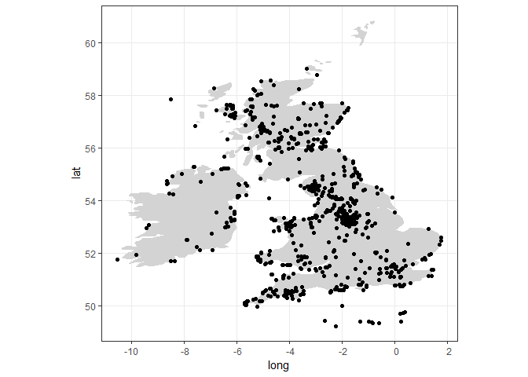

[](https://travis-ci.org/nfox29/photosearcher)

[](https://codecov.io/gh/nfox29/photosearcher?branch=master)

[](https://www.repostatus.org/#active)

<!-- README.md is generated from README.Rmd. Please edit that file -->

# photosearcher

The goal of photosearcher is to provide a repeatable methodology for
accessing the Flickr API. More information can be found on the [package
website](https://nfox29.github.io/photosearcher/). For more information
and examples of the functions check out the [package
vignette](https://nfox29.github.io/photosearcher/articles/photosearcher.html).

## Terms of use

This package should be used within accordance of the [Flickr API terms
of use](https://www.flickr.com/help/terms/api).

## Installation

You can install the released version of photosearcher from github with:

``` r
devtools::install_github("nfox29/photosearcher")
```

## Getting an API key

The package requires a valid API key from the [Flickr development
page](https://www.flickr.com/services/apps/create/). The first time you
call a function from the package, you will be prompted to create and
enter your API key. The API key will then be saved as a .txt file and be
called when using any other function.

## Package functions

The package currently focuses on the ability to use the Flickr API to
search for images and their metadata throught the flickr.photos.search
method. The package does however support a number of other Flickr API
call methods including the flickr.tags.getRelated and
flickr.places.tagsForPlace methods. The Flickr website offers full [API
Documentation](https://www.flickr.com/services/api/) for all of its call
methods.

## Searching for photo metadata

In this example, we demonstrate how to search for metadata on all images
labelled with the text or keywords *rock climbing* between 2010 and 2019
in the UK and Ireland.

``` r
library(photosearcher)

rock_climbing <- photo_search(
  mindate = "2010-01-01",
  maxdate = "2018-01-01",
  text = "rock climbing",
  bbox = "-12.875977,49.210420,2.636719,59.977005",
  has_geo = TRUE
)  
```

When `has_geo == TRUE` only metadata about images with latitude and
longitude infomation will be retrieved. These can be plotted using other
packages at user preference. In the below example, we convert these to
an `sf` object and plot using `ggplot2`.

``` r
library(sf)
#> Linking to GEOS 3.6.1, GDAL 2.2.3, PROJ 4.9.3
rock_climbing <- st_as_sf(rock_climbing, coords = c("longitude", "latitude"))

library(ggplot2)
#> Registered S3 methods overwritten by 'ggplot2':
#>   method         from 
#>   [.quosures     rlang
#>   c.quosures     rlang
#>   print.quosures rlang
ggplot() +
  geom_polygon(data = map_data("world", region = c("Ireland", "UK")), 
                               aes(x=long, y = lat, group = group),
                               fill = "lightgrey") + 
  geom_sf(data = rock_climbing) + 
  theme_bw()
```



## Issues and bugs

This package requires an internet connection as well as a connection to
the Flickr API, which may not be constantly available.

If you discover a bug not associated with connection to the API that is
not already a [reported
issue](https://github.com/nfox29/photosearcher/issues), please [open a
new issue](https://github.com/nfox29/photosearcher/issues/new) providing
a reproducible example.
